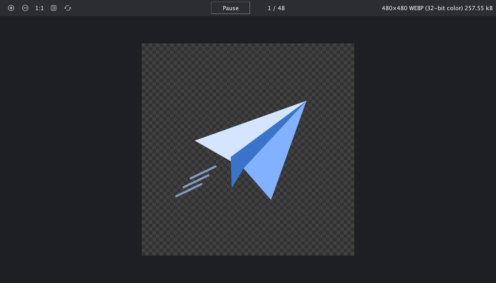

# Animated WebP Viewer

Play animated WebP directly in Android Studio editor tabs, including files outside Android or Compose resource directories. Static WebP keeps Android Studio’s built-in image preview.

* Play and pause animations without JCEF.
* Preview transparency on a checkerboard.
* Fit images within the available space while preserving their aspect ratio.
* Show original dimensions and a fixed-width frame counter.
* Reload saved changes automatically. Playback pauses when switching away from the tab.

## Install

Download the ZIP from [Releases](https://github.com/dev-weiqi/animated-webp-viewer/releases). In Android Studio, open **Settings → Plugins → gear icon → Install Plugin from Disk**, choose `animated-webp-viewer-0.1.0.zip`, then restart.

Open an animated `.webp` file using the IDE's normal open action. If the file was already open before installation, close and reopen its editor tab.

Try [paper-plane.webp](docs/paper-plane.webp) after installation. The preview above is rendered from the actual viewer component; IDE theme styling may differ.

## Development

Build with JDK 21 using `./gradlew buildPlugin`. The build uses `/Applications/Android Studio.app` by default. Override it with `-PstudioPath=/path/to/android-studio`.

Run `./gradlew check verifyPluginProjectConfiguration verifyPlugin` for automated checks and compatibility verification.

Requires IntelliJ Platform build 261 or later and the bundled WebP plugin. The initial target is Android Studio 2026.1.4. Automated checks do not replace testing editor selection in a running IDE.

## Limits

Frames retain their original resolution for 1:1 inspection. Images initially fit the viewport. Use the upper-left zoom buttons, 1:1 button, transparency toggle, and reload button; playback controls stay centered and metadata appears at the upper right. Files are limited to 32 MiB, canvases to 32 million pixels, and animations to 1,000 frames and 128 MiB of decoded frames. Color-managed ICC rendering is not supported.

## License

Apache License 2.0. The playback and decoding code is adapted from [CMP Resource Manager](https://github.com/dev-weiqi/cmp-resource-manager).
